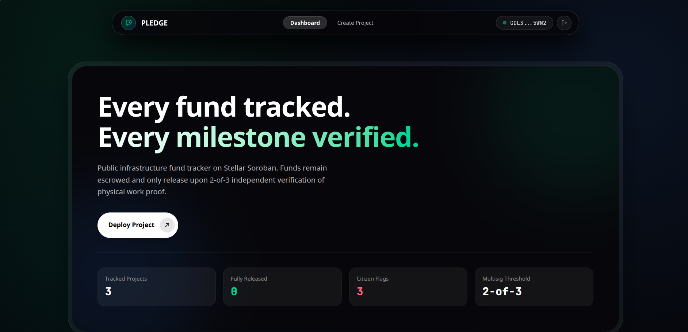
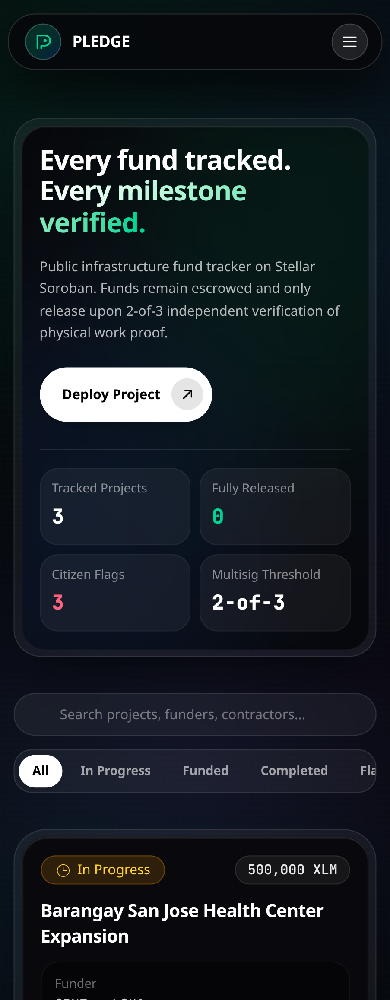
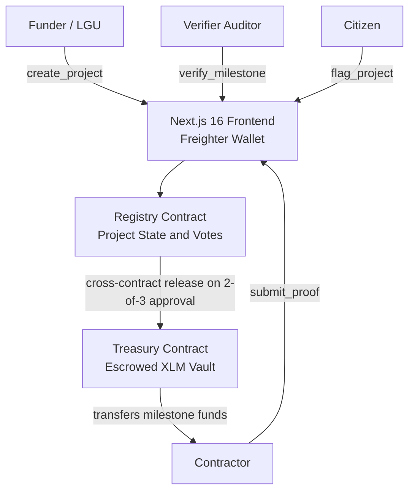

<div align="center">

  

  # PLEDGE
  ### Public Infrastructure Fund Tracker

  *Every project pledged, every fund tracked, every milestone verified.*

  [](https://soroban.stellar.org)
  [](https://nextjs.org)
  [](#testing)
  [](#responsive-design)
  [](https://stellar.expert/explorer/testnet)

</div>

---

## Overview

Pledge is a public, on-chain infrastructure fund tracker built on **Stellar Soroban smart contracts**. Public infrastructure projects are traditionally funded in tranches tied to construction milestones. Without transparent public verification, funds are vulnerable to misuse, delays, and incomplete work.

Pledge locks project funds in an escrow vault contract and releases them to contractors only upon independent **2-of-3 multisig verification** of physical evidence pinned to IPFS.

---

## Live Demo and Contract Addresses

| Item | Link / Value |
|---|---|
| **Live Application** | [pledge-dapp.vercel.app](https://pledge-dapp.vercel.app) |
| **Demo Video** | [View on YouTube](https://youtube.com) |

### Deployed Contracts (Stellar Testnet)

| Contract | Address | Explorer |
|---|---|---|
| Registry | `CCZES3TPZTDVUEX3BVZOL7MT2JDPNCVVK6TTG6N2NZQLBQQYEIJESRDQ` | [View on Stellar Expert](https://stellar.expert/explorer/testnet/contract/CCZES3TPZTDVUEX3BVZOL7MT2JDPNCVVK6TTG6N2NZQLBQQYEIJESRDQ) |
| Treasury | `CBTFXIKFJSAMNEKOLOMPFOHFUKG2NE3RYZTMRM63DAJB3TSFSN5U622H` | [View on Stellar Expert](https://stellar.expert/explorer/testnet/contract/CBTFXIKFJSAMNEKOLOMPFOHFUKG2NE3RYZTMRM63DAJB3TSFSN5U622H) |

### Deployment Transactions

| Transaction | Hash |
|---|---|
| Treasury Deploy | `b9e37af8ad067d6042999c91ab928f9d12ab107021d38a073cdec753f31e723c` |
| Registry Deploy | `f5c3d848610a07479bc59ba21583c48374221f303984a83d39586dd7aa8ccad4` |
| Treasury Init | `c1533d65b30f3f58faa566503b3c44e8fc48c72197455a6d62ea6fe0e0dfd387` |
| Registry Init | `99744ea2e097b59ca80994aa6e1a707868bad639659f3510302c789ead77b5e1` |

---

## Screenshots

| View / Evidence | Preview | Description |
|---|:---:|---|
| **Dashboard (Desktop)** |  | Main public infrastructure project tracking dashboard |
| **Mobile UI (320px Viewport)** |  | Responsive layout supporting 320px screen width with mobile navigation drawer |
| **CI/CD Pipeline** |  | Automated GitHub Actions workflow compiling WASM binaries and executing contract tests |
| **Contract Test Output** |  | Terminal execution of `cargo test --workspace` with 3 passing Soroban contract tests |

### Verified Test Output

```text
running 2 tests
test test::test_unauthorized_proof_submission - should panic ... ok
test test::test_registry_full_workflow ... ok

test result: ok. 2 passed; 0 failed; 0 ignored; 0 measured; 0 filtered out; finished in 0.09s

running 1 test
test test::test_treasury_init_and_release ... ok

test result: ok. 1 passed; 0 failed; 0 ignored; 0 measured; 0 filtered out; finished in 0.02s
```

---

## Key Features

| Feature | Description |
|---|---|
| **Escrow Vault** | Total project budget is locked in the Treasury contract on creation. Funds cannot be withdrawn without 2-of-3 verifier approval. |
| **2-of-3 Multisig** | Each milestone release requires approval from 2 of 3 registered independent verifiers. |
| **IPFS Evidence** | Off-chain evidence (photos, reports, certificates) is uploaded to IPFS. Only the CID hash is stored on-chain. |
| **Public Flagging** | Any citizen wallet can flag a project for public audit visibility directly on-chain. |
| **Event-Driven UI** | On-chain events (`created`, `proof_sub`, `verified`, `released`, `flagged`) drive real-time status updates in the frontend. |
| **Mobile Ready** | Full UI support down to 320px viewport with a floating pill navbar and mobile drawer. |

---

## How It Works

Pledge has four roles. Each role interacts with the system differently.

| Role | Who They Are | What They Can Do |
|---|---|---|
| **Funder** | Government or LGU | Creates a project, defines milestone payment schedule, locks total budget into escrow |
| **Contractor** | Construction company | Uploads physical evidence (photos, documents) per milestone |
| **Verifier** | Independent auditors (3 registered per project) | Reviews evidence and casts an approve or reject vote |
| **Citizen** | Any wallet | Views all projects publicly, flags suspicious or stalled projects on-chain |

### Full Project Lifecycle

**Step 1: Funder creates the project**

The funder connects their Freighter wallet and fills out the Create Project form: project name, contractor wallet address, three verifier wallet addresses, and a milestone payment schedule. When submitted, the total budget is transferred atomically from the funder's wallet into the **Treasury contract** (escrow vault). The funds are now locked in code. Nobody can withdraw them without verifier approval.

**Step 2: Contractor submits proof**

After completing a phase of physical work, the contractor connects their wallet, opens the project, and uploads photo or document evidence for that milestone. The file is uploaded to **IPFS** (a decentralized file network), which returns a unique content hash called a CID (e.g. `bafybeig...`). This CID is a tamper-proof fingerprint of that exact file. The CID is then written permanently on-chain via `submit_proof`. If the file is ever altered, the hash changes and the fraud is immediately detectable.

**Step 3: Verifiers review and vote**

The three registered verifiers each connect their wallets. They see the milestone is pending verification, click "Inspect Evidence," and view the actual uploaded file from IPFS. Each verifier votes Approve or Reject. The moment 2 out of 3 vote Approve, the Registry contract automatically cross-invokes `Treasury.release()`, transferring the milestone funds directly to the contractor's wallet. No human intermediary. No manual bank transfer.

**Step 4: Citizens audit publicly**

Anyone can open the dashboard and view all projects, their status, milestone progress, and flag counts. If a project appears stalled or fraudulent, any citizen wallet can hit "Flag Project" to record a permanent public audit signal on-chain. Every transaction is visible on Stellar Expert for anyone to verify forever.

---

## Architecture



### Data Flow

| Step | Actor | Action |
|---|---|---|
| 1. Create | Funder | Calls `create_project`. Budget transferred to Treasury escrow atomically. |
| 2. Submit Proof | Contractor | Uploads evidence to IPFS, submits CID to Registry for a milestone. |
| 3. Verify | Verifiers | Each registered verifier casts an approve or reject vote. |
| 4. Release | Registry | On 2-of-3 approvals, Registry cross-invokes `Treasury.release()`, sending funds to contractor. |
| 5. Flag | Citizen | Any wallet calls `flag_project` to raise a public audit flag. |

---

## Repository Structure

```
pledge/
├── .github/
│   └── workflows/
│       └── ci.yml                  # GitHub Actions CI (contract tests + frontend build)
├── contracts/
│   ├── registry/                   # Soroban Registry contract
│   │   ├── src/
│   │   │   ├── lib.rs              # Milestone state machine, voting, cross-contract release
│   │   │   └── test.rs             # Workflow and authorization tests
│   │   └── Cargo.toml
│   └── treasury/                   # Soroban Treasury contract
│       ├── src/
│       │   ├── lib.rs              # Escrow vault, release control
│       │   └── test.rs             # Init and release tests
│       └── Cargo.toml
├── docs/
│   └── screenshots/                # README screenshots
├── frontend/                       # Next.js 16 App Router dApp
│   ├── app/                        # Pages: Dashboard, Create, Project Detail
│   ├── components/                 # Navbar, Footer, ProjectCard, PledgeLogo
│   ├── lib/                        # Soroban RPC client, Zustand store, TypeScript types
│   ├── public/                     # Static assets
│   └── package.json
├── scripts/
│   └── deploy.sh                   # Contract build and deploy helper
└── Cargo.toml                      # Workspace config
```

---

## Smart Contracts

Both contracts are written in Rust using `soroban-sdk v22.0.0`.

### Registry Contract

| Function | Access | Description |
|---|---|---|
| `init(treasury)` | Deployer | Sets the Treasury contract address. One-time. |
| `create_project(funder, name, contractor, verifiers, milestone_descriptions, milestones_amounts, token)` | Any wallet | Creates a project, locks total budget in Treasury. |
| `submit_proof(caller, project_id, milestone_id, evidence_ipfs_cid)` | Contractor only | Attaches IPFS evidence CID to a milestone. |
| `verify_milestone(caller, project_id, milestone_id, approve)` | Verifiers only | Casts approve/reject vote. 2-of-3 approvals trigger fund release. |
| `flag_project(caller, project_id)` | Any wallet | Registers a public audit flag on a project. |
| `get_project(project_id)` | Read-only | Returns full project struct. |

### Treasury Contract

| Function | Access | Description |
|---|---|---|
| `init(admin, token)` | Deployer | Sets the admin (Registry) and token address. One-time. |
| `release(to, amount)` | Registry only | Transfers escrowed funds to the contractor address. |
| `get_admin()` | Read-only | Returns the admin address. |
| `get_token()` | Read-only | Returns the token contract address. |

---

## Prerequisites

| Requirement | Version | Notes |
|---|---|---|
| Rust & Cargo | 1.80+ | `rustup target add wasm32-unknown-unknown` |
| Node.js | 22+ | With npm |
| Stellar CLI | 27.1.0+ | For contract deployment |
| Freighter Wallet | Latest | Browser extension for Stellar transactions |

---

## Getting Started

### 1. Clone the repository

```bash
git clone https://github.com/your-username/pledge.git
cd pledge
```

### 2. Run contract tests

Verify the full contract suite passes before anything else.

```bash
cargo test --workspace
```

Expected output:

```text
test test::test_unauthorized_proof_submission - should panic ... ok
test test::test_registry_full_workflow ... ok
test result: ok. 2 passed; 0 failed

test test::test_treasury_init_and_release ... ok
test result: ok. 1 passed; 0 failed
```

### 3. Build the WASM contracts

```bash
stellar contract build
```

Outputs optimized binaries to `target/wasm32v1-none/release/`.

### 4. Generate and fund a deployer account

```bash
stellar keys generate deployer --network testnet
curl "https://friendbot.stellar.org?addr=$(stellar keys address deployer)"
```

This creates a fresh Stellar keypair and funds it with free testnet XLM via Friendbot.

### 5. Deploy the contracts

Deploy Treasury first, then Registry.

```bash
TREASURY_ID=$(stellar contract deploy \
  --wasm target/wasm32v1-none/release/treasury.wasm \
  --source deployer \
  --network testnet)

REGISTRY_ID=$(stellar contract deploy \
  --wasm target/wasm32v1-none/release/registry.wasm \
  --source deployer \
  --network testnet)

echo "Treasury: $TREASURY_ID"
echo "Registry: $REGISTRY_ID"
```

### 6. Initialize the contracts

Treasury must know the Registry address as its admin. Registry must know the Treasury address for cross-contract fund release.

```bash
# Initialize Treasury: admin = Registry, token = native XLM
stellar contract invoke \
  --id $TREASURY_ID \
  --source deployer \
  --network testnet \
  -- init \
  --admin $REGISTRY_ID \
  --token CDLZFC3SYJYDZT7K67VZ75HPJVIEUVNIXF47ZG2FB2RMQQVU2HHGCYSC

# Initialize Registry: point it to the Treasury
stellar contract invoke \
  --id $REGISTRY_ID \
  --source deployer \
  --network testnet \
  -- init \
  --treasury $TREASURY_ID
```

### 7. Configure the frontend

Create `frontend/.env.local` with your deployed contract addresses:

```env
NEXT_PUBLIC_REGISTRY_CONTRACT_ID=<your registry address>
NEXT_PUBLIC_TREASURY_CONTRACT_ID=<your treasury address>
NEXT_PUBLIC_SOROBAN_RPC_URL=https://soroban-testnet.stellar.org
NEXT_PUBLIC_NETWORK_PASSPHRASE=Test SDF Network ; September 2015
```

### 8. Run the frontend

```bash
cd frontend
npm install
npm run dev
```

Open [http://localhost:3000](http://localhost:3000).

---

## Using the App

### Before You Start

All on-chain actions require the **Freighter wallet** browser extension installed and configured on the Stellar Testnet network. Testnet XLM (used for transaction fees and escrow) is free and can be obtained from [friendbot.stellar.org](https://friendbot.stellar.org).

| Requirement | Where to Get It |
|---|---|
| Freighter wallet extension | [freighter.app](https://freighter.app) |
| Switch network to Testnet | Freighter settings > Network > Testnet |
| Free testnet XLM | [friendbot.stellar.org](https://friendbot.stellar.org) |

---

### Role 1: Funder (Government / LGU)

The Funder is responsible for creating the project and locking the total budget into escrow.

1. Open the application at [pledge-dapp.vercel.app](https://pledge-dapp.vercel.app).
2. Click **Connect Wallet** in the navigation bar. Freighter will open and ask for permission. Approve it.
3. Click **Deploy Project** on the dashboard.
4. Fill in the project form:

   | Field | What to Enter |
   |---|---|
   | Project Title | Name of the infrastructure project |
   | Contractor Wallet Address | The Stellar public key (`G...`) of the construction company |
   | Verifier 1 Address | Stellar public key of the first independent auditor |
   | Verifier 2 Address | Stellar public key of the second independent auditor |
   | Verifier 3 Address | Stellar public key of the third independent auditor |
   | Milestone Description | Brief description of each construction phase |
   | Milestone Amount (XLM) | XLM payment to release upon completion of that phase |

5. Review the total escrow budget shown at the bottom of the form.
6. Click **Deploy and Escrow**. Freighter will open a transaction signing prompt.
7. Review the transaction details and click **Approve** in Freighter.
8. The total budget is now locked in the Treasury smart contract. The project appears on the dashboard immediately.

---

### Role 2: Contractor (Construction Company)

The Contractor submits physical evidence of completed work for each milestone.

1. Open the application and click **Connect Wallet**. Your wallet address must match the contractor address the Funder registered.
2. Find your project on the dashboard and click **Details**.
3. Locate a milestone with the status **Awaiting Contractor Proof**.
4. Click **Submit Work Proof**.
5. Select your evidence file (photograph, engineering certificate, or PDF report) from your device.
6. Click **Submit Proof**. The application will:
   - Upload the file to IPFS and generate a tamper-proof content hash (CID).
   - Submit that CID to the Registry contract on-chain.
   - Prompt Freighter to sign the transaction. Click **Approve**.
7. The milestone status changes to **Pending Verification**. The three verifiers are now able to review and vote.

---

### Role 3: Verifier (Independent Auditor)

Each project has exactly three registered verifiers. Two of the three must approve a milestone before funds are released.

1. Open the application and click **Connect Wallet**. Your wallet address must match one of the three verifier addresses registered for the project.
2. Find the project on the dashboard and click **Details**.
3. Locate a milestone with the status **Pending Verification**.
4. Click **Inspect Evidence**. A modal opens showing the IPFS content hash and gateway links to the actual uploaded file.
5. Review the evidence file by clicking **IPFS Public Gateway** or **DWeb Gateway** to open the file in your browser.
6. Return to the milestone and cast your vote:
   - Click **Approve** if the physical work matches the milestone description.
   - Click **Reject** if the evidence is insufficient or fraudulent.
7. Freighter will prompt you to sign the vote transaction. Click **Approve**.
8. Once a second verifier approves, the Registry contract automatically releases the milestone funds to the contractor. No further action is required from any party.

---

### Role 4: Citizen (Public)

Any person can monitor all projects and raise a public audit flag without any special permissions.

**Viewing projects (no wallet required):**

1. Open the application at [pledge-dapp.vercel.app](https://pledge-dapp.vercel.app).
2. The dashboard displays all projects with their current status, milestone progress, and flag counts.
3. Click **Details** on any project to view the full milestone schedule, verifier addresses, escrowed budget, and submitted evidence CIDs.

**Flagging a suspicious project:**

1. Connect any Stellar wallet using **Connect Wallet**.
2. Open the project detail page for the project you want to flag.
3. Click **Flag Project** in the top right of the project header.
4. Freighter will prompt you to sign. Click **Approve**.
5. The flag count on the project increments permanently on-chain and is visible to all users.

---

## CI/CD

GitHub Actions workflow at `.github/workflows/ci.yml` runs on every push:

| Job | Steps |
|---|---|
| Contracts | Install Rust, add `wasm32` target, run `cargo test --workspace`, build WASM |
| Frontend | Install Node.js 22, `npm install`, `npm run lint`, `npm run build` |

---

## Tech Stack

| Layer | Technology |
|---|---|
| Smart Contracts | Rust, soroban-sdk v22.0.0 |
| Blockchain | Stellar Testnet (Soroban) |
| Frontend Framework | Next.js 16 (App Router) |
| Wallet Integration | Freighter via `@stellar/freighter-api` |
| Blockchain Client | `@stellar/stellar-sdk` |
| State Management | Zustand |
| Styling | Tailwind CSS v4 |
| Icons | Phosphor Icons |
| IPFS | Web Crypto SHA-256 IPFS CIDs |
| Data Fetching | TanStack Query |

---

## External & Documentation Links

- [Stellar Developer Documentation](https://developers.stellar.org)
- [Soroban Smart Contracts Documentation](https://soroban.stellar.org)
- [Freighter Wallet Extension](https://www.freighter.app)
- [Frontend Application Documentation](frontend/README.md)