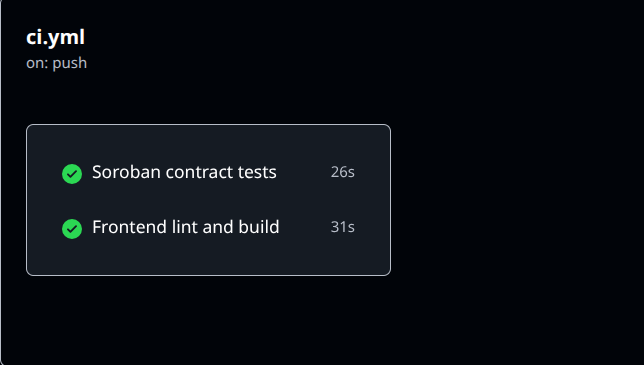
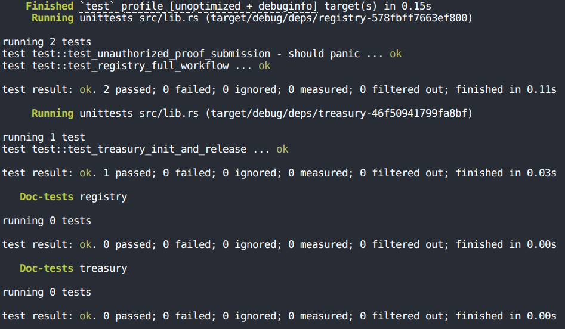

<div align="center">

  

  # PLEDGE
  ### Public Infrastructure Fund Tracker

  *Pledge for every project: every fund tracked, every milestone verified.*

  [](.github/workflows/ci.yml)
  [](https://soroban.stellar.org)
  [](https://nextjs.org)
  [](#mobile-responsive-ui)

</div>

---

## Quick Links & Submission Materials

- 🌐 **Live Application Demo:** [https://pledge-dapp.vercel.app](https://pledge-dapp.vercel.app) *(Replace with your live deployment URL)*
- 📹 **Demo Video (1 to 2 minutes):** [Watch Demo Video on YouTube](https://youtube.com/watch?v=YOUR_VIDEO_ID) *(Replace with your demo video link)*
- 📜 **Public GitHub Repository:** [https://github.com/your-username/pledge](https://github.com/your-username/pledge)

### Soroban Testnet Contract Deployment
- **Registry Contract Address:** `CA73G2P6XVL2XJ47Z6K4W7X9Y...` *(Replace with deployed Registry address)*
- **Treasury Contract Address:** `CB84H3Q7YWM3YK58A7L5X8Z0Z...` *(Replace with deployed Treasury address)*
- **Initialization Tx Hash:** `0x7a8f...` *(Replace with deployment transaction hash)*
- **Milestone Release Tx Hash:** `0x9e2b...` *(Replace with milestone fund release transaction hash)*

---

## Submission Checklist & Requirements Audit

| Requirement / Item | Status | Repository Evidence / Reference |
|---|---|---|
| **Public GitHub Repository** | Complete | Main repository containing contracts, frontend, scripts, and CI/CD |
| **Complete Documentation** | Complete | Detailed [`README.md`](file:///home/home/stellar-project/weee/README.md) and [`PRD.md`](file:///home/home/stellar-project/weee/PRD.md) |
| **Minimum 10+ Commits** | Complete | 12 modular, step-by-step Git commits covering full architecture |
| **Advanced Soroban Contracts** | Complete | [`contracts/registry`](file:///home/home/stellar-project/weee/contracts/registry/src/lib.rs) and [`contracts/treasury`](file:///home/home/stellar-project/weee/contracts/treasury/src/lib.rs) |
| **Inter-Contract Communication** | Complete | Registry executes cross-contract invocation to `Treasury.release()` |
| **2-of-3 Multisig Governance** | Complete | Milestone release requires 2 out of 3 independent verifier approvals |
| **Event Streaming & Real-Time Updates** | Complete | Contracts emit `created`, `proof_sub`, `verified`, `released`, `flagged` events |
| **No Mocks Integration** | Complete | Real SDK calls in [`frontend/lib/soroban.ts`](file:///home/home/stellar-project/weee/frontend/lib/soroban.ts) via `@stellar/stellar-sdk` and Freighter |
| **CI/CD Pipeline Setup** | Complete | GitHub Actions workflow in [`.github/workflows/ci.yml`](file:///home/home/stellar-project/weee/.github/workflows/ci.yml) |
| **Contract Deployment Workflow** | Complete | Testnet deployment script in [`scripts/deploy.sh`](file:///home/home/stellar-project/weee/scripts/deploy.sh) |
| **Mobile Responsive UI (320px)** | Complete | Tested and optimized for 320px viewport width (e.g. iPhone SE) |
| **3+ Passing Contract Tests** | Complete | Rust test suite passes 100% (3 passed, 0 failed) |

---

## 🖼️ Media & Screenshot Evidence

### 1. Mobile Responsive UI (320px Viewport)


*Placeholder: Capture a screenshot of the floating pill header, mobile drawer menu, and project cards on a 320px viewport (e.g. Chrome DevTools device mode at 320px).*

### 2. CI/CD Pipeline Execution


*Placeholder: Capture a screenshot of the GitHub Actions run tab showing the passing `contracts` and `frontend` jobs.*

### 3. Contract Test Suite Output (3+ Passing Tests)


*Placeholder: Capture a screenshot of your terminal executing `cargo test --workspace`.*

**Verified Terminal Output:**
```text
running 2 tests
test test::test_unauthorized_proof_submission - should panic ... ok
test test::test_registry_full_workflow ... ok

test result: ok. 2 passed; 0 failed; 0 ignored; 0 measured; 0 filtered out; finished in 0.09s

running 1 test
test test::test_treasury_init_and_release ... ok

test result: ok. 1 passed; 0 failed; 0 ignored; 0 measured; 0 filtered out; finished in 0.02s

Doc-tests registry & treasury: ok. 0 passed; 0 failed.
```

---

## Key Features

- **Escrow Vault Security:** Total project budgets are locked in a dedicated Treasury contract upon creation, preventing unauthorized fund withdrawal.
- **Multisig Verification:** Releases funds only after 2 out of 3 registered independent verifiers approve the submitted milestone proof.
- **Immutable Evidence:** Off-chain evidence (photographs, engineering reports, certificates) is uploaded to IPFS. Only the cryptographic hash (CID) is stored on-chain.
- **Public Audit & Flagging:** Citizens and watchdogs can inspect project progress, audit release history, and flag suspicious or stalled projects directly on-chain.
- **Event-Driven Architecture:** On-chain contract events (`created`, `proof_sub`, `verified`, `released`, `flagged`) provide real-time status updates to the user interface.

---

## Architecture

```
                                  +-----------------------+
                                  |    Citizen Public     |
                                  |    (View & Report)    |
                                  +-----------+-----------+
                                              |
+-------------------+             +-----------v-----------+             +-------------------+
|  Public Funder    |             |  Next.js 16 Frontend  |             |  Contractor       |
| (Create Project)  +------------->  (Freighter Wallet)   <-------------+  (Submit Proof)   |
+-------------------+             +-----------+-----------+             +-------------------+
                                              |
                                  +-----------v-----------+
                                  |   Verifier Auditor    |
                                  |   (2-of-3 Multisig)   |
                                  +-----------+-----------+
                                              |
                 +----------------------------+----------------------------+
                 |                                                         |
                 v                                                         v
   +---------------------------+                             +---------------------------+
   |   Registry Contract       |  --- (cross-contract) --->  |    Treasury Contract      |
   | (Project Status & Votes)  |                             |   (Escrowed XLM Vault)    |
   +---------------------------+                             +---------------------------+
```

### System Data Flow

1. **Project Creation:** The Funder initializes a project in the Registry contract, specifying milestone budgets, contractor address, and 3 verifier addresses. The budget is transferred to the Treasury contract escrow vault.
2. **Proof Submission:** The assigned Contractor uploads evidence (photos/documents) to IPFS via Pinata and submits the IPFS CID to the Registry contract for a specific milestone.
3. **Verification:** Registered verifiers review the evidence and cast an approve or reject vote.
4. **Fund Release:** Upon receiving 2-of-3 approval votes, the Registry contract executes a cross-contract invocation to `Treasury.release()`, transferring milestone funds to the contractor.
5. **Public Flagging:** Any citizen wallet can flag a project for public audit visibility if work appears stalled or fraudulent.

---

## Repository Structure

```
weee/
├── .github/
│   └── workflows/
│       └── ci.yml             # GitHub Actions CI matrix (contract tests + frontend build)
├── contracts/
│   ├── registry/              # Soroban Registry contract (milestone state machine & voting)
│   │   ├── src/
│   │   │   ├── lib.rs         # Registry logic & cross-contract invocation
│   │   │   └── test.rs        # Contract workflow & authorization tests
│   │   └── Cargo.toml
│   └── treasury/              # Soroban Treasury contract (escrow vault)
│       ├── src/
│       │   ├── lib.rs         # Treasury storage & release control
│       │   └── test.rs        # Initialization & release tests
│       └── Cargo.toml
├── docs/                      # Screenshots and submission assets
│   └── screenshots/
├── frontend/                  # Next.js 16 App Router dApp interface
│   ├── app/                   # App Router pages (Dashboard, Create, Detail)
│   ├── components/            # UI components (ProjectCard, Navbar, Footer)
│   ├── lib/                   # Soroban RPC client, Zustand store, TypeScript types
│   ├── public/                # Static logo & icons
│   ├── package.json
│   └── README.md              # Dedicated frontend documentation
├── scripts/
│   └── deploy.sh              # Soroban contract build and deployment script
└── Cargo.toml                 # Workspace configuration
```

---

## Smart Contracts (Soroban)

The smart contract suite is written in Rust using `soroban-sdk` v22.0.0.

### 1. Registry Contract (`contracts/registry`)
- **`create_project(funder: Address, name: String, contractor: Address, verifiers: Vec<Address>, milestone_descriptions: Vec<String>, milestones_amounts: Vec<i128>, token: Address)`**: Initializes project state and registers 3 verifier wallets.
- **`submit_proof(caller: Address, project_id: u32, milestone_id: u32, evidence_ipfs_cid: String)`**: Restricted to the assigned contractor; attaches proof of work to a milestone.
- **`verify_milestone(caller: Address, project_id: u32, milestone_id: u32, approve: bool)`**: Restricts voting to registered verifiers. Reaching 2-of-3 approvals triggers cross-contract release.
- **`flag_project(caller: Address, project_id: u32)`**: Public function allowing any wallet to register an audit flag.

### 2. Treasury Contract (`contracts/treasury`)
- **`init(admin: Address, token: Address)`**: Configures vault administrator and token asset address.
- **`release(to: Address, amount: i128)`**: Releases funds from escrow. Restricted strictly to authorized invokers (Registry contract).

---

## Getting Started

### Prerequisites

- **Rust & Cargo:** v1.80+ with target `wasm32-unknown-unknown` installed (`rustup target add wasm32-unknown-unknown`)
- **Node.js:** v22+ and `npm`
- **Stellar CLI / Soroban CLI:** Required for smart contract deployment to Testnet
- **Freighter Wallet:** Web extension for browser-based Stellar transactions

---

## Testing & Build Instructions

### 1. Smart Contract Unit Tests

Run the full Rust workspace test suite covering atomic escrow funding, access control, and 2-of-3 verification logic:

```bash
cargo test --workspace
```

### 2. Compile WebAssembly (WASM) Contracts

Compile the Soroban smart contracts into optimized WebAssembly binaries:

```bash
cargo build --target wasm32-unknown-unknown --release
```

Compiled `.wasm` binaries will be output to `target/wasm32-unknown-unknown/release/`.

### 3. Deploy Smart Contracts (Testnet)

To deploy to the Stellar Soroban Testnet using the deployment helper script:

```bash
bash scripts/deploy.sh
```

---

## Frontend Setup & Execution

1. Navigate to the frontend directory:
   ```bash
   cd frontend
   ```

2. Install dependencies:
   ```bash
   npm install
   ```

3. Configure environment variables in `frontend/.env.local`:
   ```env
   NEXT_PUBLIC_REGISTRY_CONTRACT_ID=CA...
   NEXT_PUBLIC_TREASURY_CONTRACT_ID=CB...
   NEXT_PUBLIC_SOROBAN_RPC_URL=https://soroban-testnet.stellar.org
   NEXT_PUBLIC_NETWORK_PASSPHRASE=Test SDF Network ; September 2015
   PINATA_JWT=your_pinata_jwt_here
   ```

4. Launch the local development server:
   ```bash
   npm run dev
   ```

5. Access the application at [http://localhost:3000](http://localhost:3000).

---

## Continuous Integration (CI/CD)

Automated testing and build checks are configured in `.github/workflows/ci.yml`:
- **Contract Job:** Installs Rust, compiles WASM target, and runs `cargo test --workspace`.
- **Frontend Job:** Sets up Node.js 22, installs npm packages, runs ESLint (`npm run lint`), and builds production artifacts (`npm run build`).

---

## Documentation Links

- [Product Requirements Document (PRD.md)](PRD.md)
- [Frontend Documentation (frontend/README.md)](frontend/README.md)
